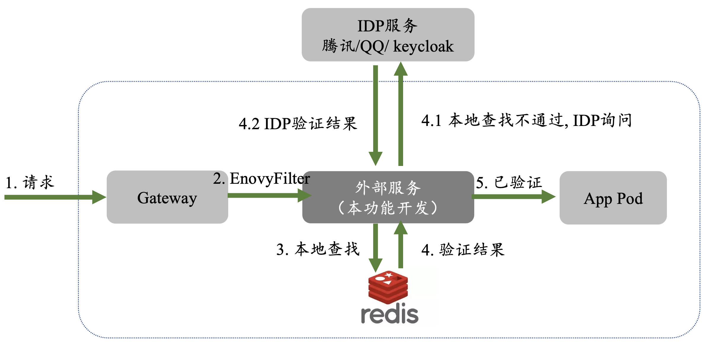

# Istio网关请求认证

## 思路方向
Istio支持基于JWT的请求认证，但是由于[微信](https://developers.weixin.qq.com/doc/oplatform/Website_App/WeChat_Login/Authorized_Interface_Calling_UnionID.html)、[QQ](https://wiki.connect.qq.com/%E6%A0%A1%E9%AA%8Ctoken%E6%98%AF%E5%90%A6%E6%9C%89%E6%95%88)等多采用OIDC授权码式的AccessToken,需要发起API请求来判断Token是否有效，不符合这一场景需要，因此可行的方案主要包括：**自定义Enovy过滤器**和**外部授权服务**。

Envoy过滤器是Istio服务网格的一部分，支持自定义逻辑处理非标准的AccessToken，集成度高、性能好、安全性强，但是主要使用WebAssembly（可以通过go编译）来开发和维护过滤器，开发成本较大，影响面较大。

外部授权服务是Istio本来提供的过滤器(ExtAuthz[1])，快速部署、配置简单，特别是与OAuth2.0相结合的实践较多[2,3,4]，社区支持广泛(特别是开源项目[authservice](https://github.com/istio-ecosystem/authservice)）。但是其性能相对弱，请求处理的延迟会增加。

综上考虑，采用**外部授权服务的**方式能够符合当前需求。在实现过程中，需要尽量考虑不同Token认证机制的**可拓展**、服务的**高性能**低延时设计。


## 方案设计
### 设计概述

**核心流程**：当请求达到网关的时候，解析请求中的**应用类别**、**Token**, 向对应的身份提供方(IDP)发起验证请求，如果请求通过，则继续透传到功能服务中。

**质量设计**：（1）可拓展性，代码实现的时候考虑不同的应用类别的选择以及增补。（2）高性能：考虑Token本身的过期和更新情况，在本地进行Token缓存。

**Tips**：OAuth2-Proxy在仅验证不登录的情况下可以考虑暂时不加入该模块。

### 具体步骤
1. 开发外部认证服务：实际开发工作，处理从传入请求中获取令牌并根据IDP对其进行验证的逻辑。
	- 解析 [CheckRequest](https://www.envoyproxy.io/docs/envoy/latest/api-v3/service/auth/v3/external_auth.proto#envoy-v3-api-msg-service-auth-v3-checkrequest)
	- 本地 Redis缓存
	- 远程 HTTP IDP请求验证
	- 编写 Dockerfile 部署服务
1. 修改Istio配置并集成：配置Istio以使用该外部授权服务，将外部服务指定为ExtAuthz过滤器的提供者。
	- 添加EnvoyFilter，配置External Authorization服务
	- 定义ExtAuthz作为endpoint应用使用
	- 配置AuthorizationPolicies，根据外部授权结果来决定请求处理方式。

### **DEMO验证**

1. 通过 docker-compose 拉起容器和服务
```bash
docker-compose up --build
```
默认是Http请求，如果是grpc请求，改用
	
```bash
1. 调整Dockerfile.envoy 第六行
COPY envoy-grpc.yaml /etc/envoy/envoy.yaml
```

2. 发送请求验证

目前的验证逻辑很简单，Authorization字段值长度超过5即可

请求失败示例(没带有头部字段)
```bash
curl -v http://localhost:9999
```
请求成功示例
```bash
curl -v -H "Authorization:bbbbbbb" http://localhost:9999
```


## 验证进展

已完成进展，相关工作见[日志](./doc/record.md)
-[X] 使用Enovy验证External Authorization功能，覆盖gRPC和http两种方式
-[X] 基于Docker Compose构建+测试脚本

待完成：
-[ ] 灵活切换两种方式，gRPC的拒绝返回结果再确认一下。
-[ ] 引入Redis缓存
-[ ] 引入真实IDP交互

## 参考文章
1. Istio OIDC Authentication: https://venafi.com/blog/istio-oidc/
2. OIDC Multi-provider Support in Istio: https://venafi.com/blog/oidc-multi-provider-support-in-istio/
3. External Authorization: https://www.envoyproxy.io/docs/envoy/latest/configuration/http/http_filters/ext_authz_filter
4. API Authentication: Configure Istio IngressGateway, OAuth2-Proxy and Keycloak: https://medium.com/@senthilrch/api-authentication-using-istio-ingress-gateway-oauth2-proxy-and-keycloak-part-2-of-2-dbb3fb9cd0d0
5. Better Istio Externel Authorization:https://istio.io/latest/zh/blog/2021/better-external-authz/